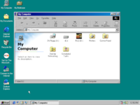
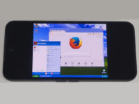
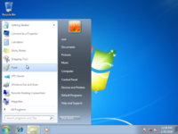

# Sem86 - A full-system x86 emulator without hardcoded semantics

- **Project page**: https://liblisa.nl/sem86
- **Sem86 will be presented at [QRS'26](https://qrs26.techconf.org/)**

[  ](https://liblisa.nl/sem86)

Sem86 is an x86 full-system emulator without hardcoded semantics.
Instead, it loads instruction semantics at runtime from an input file.
This makes it very easy to switch between different semantics,
in order to accurately emulate undefined behavior and undocumented instructions.

A long-term goal for Sem86 is to support loading instruction semantics from [libLISA's automatically inferred semantics](https://liblisa.nl).
This would enable *CPU-cloning*, that is, accurately emulating all instructions, including undefined behavior and undocumented instructions, of a specific CPU.
Currently, semantics are still handwritten.

**Sem86 is a research project. It is not ready for production use.**

# Usage
You must have a working `cargo` on your machine. 
Currently, Sem86 only works on Linux and Android.

First, generate the CPU instruction semantics:

```
cargo run -r --bin semgen -- generate x86.semantics
```

Then, run the emulator:
```bash
cargo run -r --bin sem86 -- \
    --semantics x86.semantics \
    --rom bios/BIOS-bochs-latest \
    --rom C0000:bios/VGABIOS-lgpl-bochs.bin \
    --vgabios bios/VGABIOS-lgpl-bochs.bin \
    --ide-0-0 ./disks/w98.img
```

Note that you must provide your own disk image `./disks/w98.img`.
Sem86 uses copy-on-write disk images.
This means that changes are not written to disk, but stored in memory.
This ensures the emulator always starts from a deterministic state.
IDE disk 0:0 can be made writable with the `--ide-0-0-writable` flag.
However, note that this may alter the disk image and may cause data corruption when terminating the emulator without properly shutting down the OS.

# Bisection
Sem86 can switch instruction semantics at runtime.
This makes it possible to *bisect* execution, and find the exact instruction that, for example, malware is relying on to detect an emulated environment.

For the scenario described in the paper, we used the following command:

```bash
cargo run -r --bin bisect -- \
    --min 380000000 --max 399000000 \
    --screenshot-mask-taskbar-clock \
    --classify-from-screenshot capture.png \
    -- target/release/sem86 \
    --semantics x86-noimulzf.semantics \
    --rom bios/BIOS-bochs-latest \
    --rom C0000:bios/VGABIOS-lgpl-bochs.bin \
    --vgabios bios/VGABIOS-lgpl-bochs.bin \
    --ide-0-0 disks/w98.img \
    --switch-semantics-to x86.semantics \
    --switch-semantics-at '#' \
    --num 450000000 \
    --screenshot-when-done capture.png \
    --exit-when-done \
    --synchronous-clock \
    --resume-from-snapshot snapshots/bisect.snapshot
```

This finds the instruction that causes a difference in the display output of the emulator after executing 450M instructions.
It finds this difference in instruction execution 380M-399M.

Sem86 is provided with the arguments `--switch-semantics-to` and `--switch-semantics-at` to switch semantics during execution.

A snapshot is used to speed up bisection.
Such a snapshot can be made by running Sem86 with `--snapshot-when-done <file>` and `--num N`.

# License
Sem86 is [licensed under the AGPLv3](./LICENSE).